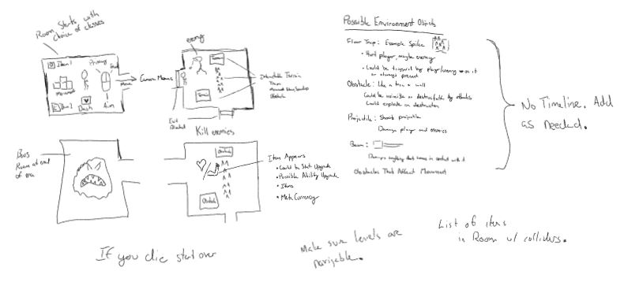
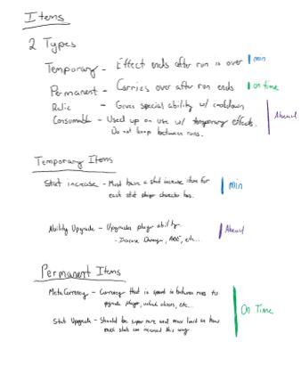
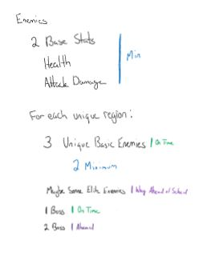
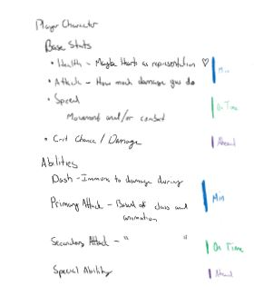
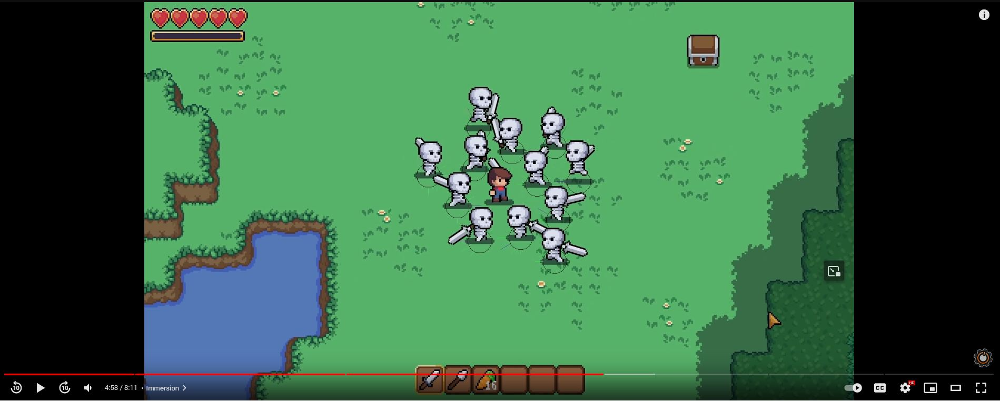
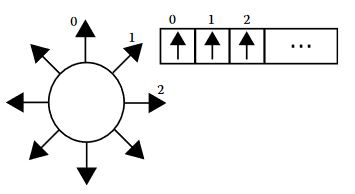
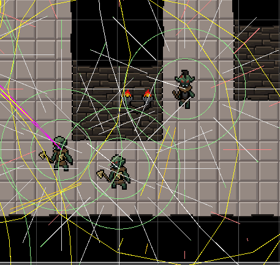
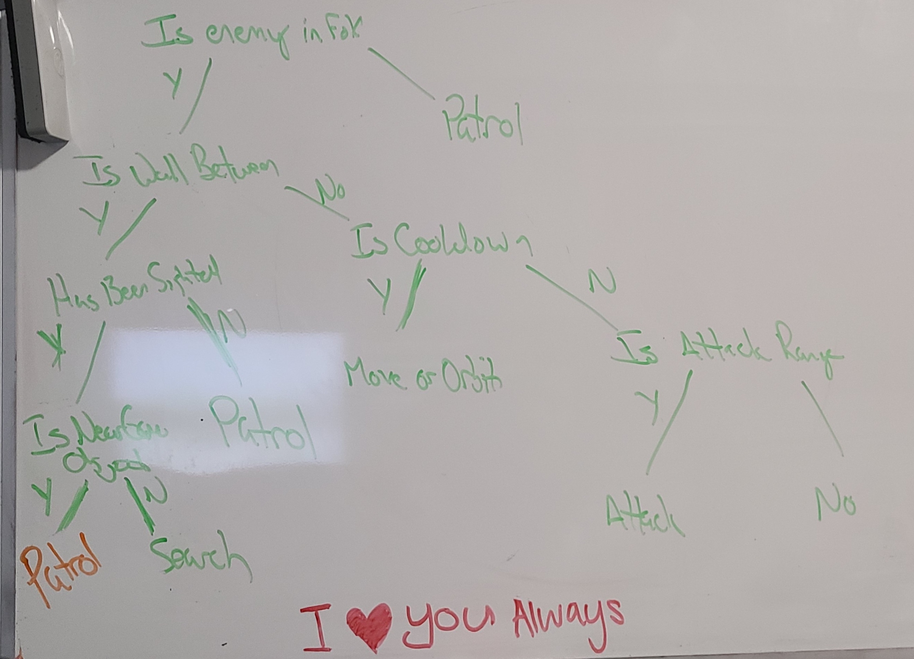
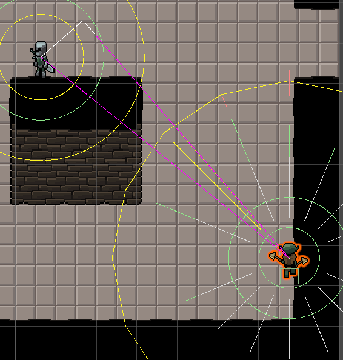

# Bradly T Booth
btbooth@ucdavis.edu

### Preface
I want to start by saying that my work in this role and has been very challenging but some of the most rewarding work that I have done in my time here at Davis. Working with this group of people has been an incredible experience. This is the first group project that I have worked on here at Davis that I feel has been truly collaborative. We worked well together, gave feedback where needed and listned to others what had to say. Everyone worked hard and made major contributions to the game. So thank you for the positive experience before I graduate.

## Co-Producer / Game Design
I was very active in the early stages of this role. I spent a lot of time designing the game. I drew paper prototypes for the core game loop, which was quite distracting as I did much of this during lectures. Early concept for the game was a simple roguelite. You start in a dungeon, you move from room to room battling enemies. When you enter a room, you cannot leave it until all enemies are dead. Once all enemies are defeated, an item or meta currency drops and you move onto the next room. If you die, you go to what we call the pre-run area, lose all items and tempory stat buffs you received during the run, but keep the meta currency. Meta currency can be used to permanately buff the player character. This was the core design that our team began working with. Some elements are very different due to time or asset limitations but overall we stuck very closely to this core design loop and I am very happy with how it turned out.

After initial prototyping and planning the core game loop, we started discussing assets. We began early searching for free assets that we could use for our game. Most of our early meetings were spent discussing types of assets we were looking for, and searching for them. We put a lot of focus on finding assets first because we none in the group are designers. We needed good assets to design the mechanics of our game around. I think this strategy really payed off. We found, or more clearly Russel, an asset pack on itch.io by FoozleCC called [Lucifer](https://itch.io/c/1557879/lucifer "Lucifer Asset Collection") where we got most of our visual assets from. With what assets we planned on using, we divided work amongst ourselves and got to work creating our game.

From here the amount of time I spent in this role dwindled. Connor spend a good amount time and effort organizing our efforts and leading biweekly meatings where everyone could check in and update on their status. During these meetings I very much played an active role in discussing design decisions, but once the creative juices started flowing, I took a step back and focussed on my other role.

Below are some early prototypes I drew and wrote up for my initial design of the game. I think we were pretty faithful to this initial design plan, though the initial plan was a bit ambitious. We had to forgo bosses and environmental hazards, as well many other enemy types that we wanted to implement.

## Enemy AI
### Role Brief
This role focuses on developing the enemies that are going to be present in our game. The person in charge of this role will be designing the AI of the Enemies, the actions that the enemies can make, and the states that the enemy goes through during its life cycle. This also includes any bosses that are present within our game.

### Research
Immediatly after taking on this role I started researching Enemy AI, or more accurately AI movement. We hadn't had the lecture on this topic in class yet, so I was on my own. Additionally, I have not taken ECS 170. Looking up different enemey movement algorithms, the first thing I stumbled upon was A*. After spending a little time learning about A*, I decided that I did not want to use A*. In my head, the combat area that enemies would be moving through would be open, with walls only around the edge of the battle area and A* seemed unecessary for an open area. 
In the those early days, we planned for environmental obsticals in the combat area. Ideally, I wanted an enemy that didn't just efficiently move to the enemy, but responded to the threats of the envrinoment. I happened to stumble upon this video:

 
* * *
### Context Steering
The video above, by Game Endeavor, introduced me to the idea of context steering as well as linked an article titled [Context Steering Behavior-Driven Steering at the Macro Scale](http://www.gameaipro.com/GameAIPro2/GameAIPro2_Chapter18_Context_Steering_Behavior-Driven_Steering_at_the_Macro_Scale.pdf) written by Andrew Fray. This article introduces the problem with some popular steering behaviors and introduces Context Steering. "The context steering framework deals in the currency of context maps...Internally, the context map is an array of scalar values, with each slot of the array representing a possible heading, and the contents of the slot representing how strongly the behavior feels about this heading."

Multiple behaviors can be attritubed to a different context map which effect the values of each possible heading differently. Then different headings from the multiple behaviors can be averaged together. The heading with the highest value is the heading that the algorithm wants to go. The paper sets up different behaviors that could be implemented and argues that using this system, the AI can make an informed decision about where it wants to go with context from the environment without using and overbloated decision tree.

Needless to say, I was sold on this system. Early into this journey, I did attempt to implement my system for this, but I did not have the time to fully commit myself to this task. This is when I stumbled on [Polarith AI](https://assetstore.unity.com/packages/tools/ai/polarith-ai-free-movement-with-2d-sensors-92029), both my personal savior and the bane of my existance.

* * *
### Polarith AI
On the unity page, Polarith AI advartises itself as, "Polarith AI offers all you need for achieving state-of-the-art movement AI with just a few clicks. Design complex movement behaviours and create immersive games or astonishing simulations by taking advantage of the sophisticated workflow." This is a context steering AI package that was a bit of a pain to work with. The core concept of their design is that they have many different pre-defined behaviors as components. You can attach these behaviors to gameObject, set different parameters of that behavior and system will give a direction that it wants to move based on the different behaviors attached. On these behaviours, you can assign individual gameObjects as objects of interest or a LayerMask, where everything on that layer is of interest. Each component has useful visual debugging gizmos to see how it responds to various inputs in the world.

.gif>)

The gif above shows the enemies moving around with their sensors visible. The yellow line shooting out from the enemies is the direction that the system has chosen to move. Green lines are directions that the enemies wish to move towards while red lines are directions the enemies want to avoid.  Ignore, the purple lines for now. Each behavior has a radius you can set for the behavior as well as a weight to that behavior and different options for what is called Radius Mapping. Radius Mapping uses different functions that change the weight based on distant to the target. Constant for example does not change the weight regardless of distance, whereas Inverse Quadratic drasticly increases the weight the closer you are to the player. You can use these to make some cool and behaviors. For example, I used Inverse Quadratic and a high weight for walls, because I did not want the enemy to every leave the combat arena or get trapped in a corner. Whereas, I made seeking the player constant because as long as the enemy had a clear path to the player, it should try to move to them.

Early tests with this system yielded positive results and after committing a frustrating amount of time, I realized a huge limitation to this package. Up until this point, all the implementations of Context Steering that I had learned about use Rays cast out from the enemy, which sense various things in the environmnet. Polarith does not use rays, but tracks the position of all objects of interest in the scene. This became frustratingly problematic. The enemies needed to avoid the walls surrounding the combat and arena, but the combat arena used a tilemap with collision. The position of the tilemap was (0,0). So instead of avoiding the edges of the play area, the AI would avoid the center of the map. Our solution to this was to position an empty gameObject to each tile on the map, and make those gameObjects items to avoid. This worked ok. With this approach, the enemy had trouble navigating around and getting stuck on corners. This, I believe, is do to them sensing the gameObject centered on the tile rather than the wall itself. So when going around corners, you can see they hug the corners cause they believe that there is no wall there.

In total, I used 11 different behavior components on each enemy. I turn different behaviors on and off dependent on the state of the enemy. Setting up these different behaviors in tandom with getting class script going was probably 2 weeks worth of effort. Below I have linked the various prefabs and scripts I wrote for enemey behavior:

This Prefab holds all the steering behaviors attached to the enemies.
https://github.com/ConanoftheUnreal/ECS189L-Final-Project/blob/efdbc6babd30c1977519a158b6ddb377e5998599/Lucifer's%20Trials/Assets/Resources/Prefabs/ContextSteering.prefab

This Prefab is placed in the scene, and is used to assist the package in working with Unity Layer system, as well as tracking objects of interest added at runtime.
https://github.com/ConanoftheUnreal/ECS189L-Final-Project/blob/efdbc6babd30c1977519a158b6ddb377e5998599/Lucifer's%20Trials/Assets/Resources/Prefabs/Steering%20Perceiver.prefab

This Script is the bulk of the code I wrote. It inherits from an abstract enemy class which inherits from an interface. The interface I used to implement the factory pattern for creating enemies.
https://github.com/ConanoftheUnreal/ECS189L-Final-Project/blob/efdbc6babd30c1977519a158b6ddb377e5998599/Lucifer's%20Trials/Assets/Scripts/Enemy/Goblin%20Beserker/GoblinBeserker.cs

This script is the factory for producing Goblin Beserkers, the melee enemy. Their is an identical factory for producing Goblin Slingers. Have two different factories with the same script cause it was easy to identify which factory produced which enemy based off the name of the factory. Both enemy types use the same script to control their behavior.
https://github.com/ConanoftheUnreal/ECS189L-Final-Project/blob/efdbc6babd30c1977519a158b6ddb377e5998599/Lucifer's%20Trials/Assets/Scripts/Factory/FactoryGoblinBeserker.cs

### Decision Tree
Once I got all the behavior components worked out I moved onto implementing the descision script. This was relatively simple, I drew up a decision tree and implemented the tree using nesting if statements. The nest goes pretty deep but it the logic is simple and easy to follow.

https://github.com/ConanoftheUnreal/ECS189L-Final-Project/blob/efdbc6babd30c1977519a158b6ddb377e5998599/Lucifer's%20Trials/Assets/Scripts/Enemy/Goblin%20Beserker/GoblinBeserker.cs#L341-L412

Below are a list of the enemy states and their descriptions:

**Patrol** - When the player is out of the enemies range of vision or not within line of sight, with some exception, the enemy will wander around aimlessly.
**Search** - If the player was within line of sight and range of vision but line of sight was lost, the enemy will move to last known location. Upon arriving if the player is not within line of sight, enter patrol.
**Move** - Moves directly to player, unless environmental obsticals are in the way.
**Orbit** - Orbit occurs when the enemies attack is on cooldown. When in orbit range, the enemy will move to cirlce the player out of range of its attacks.
**Attack** - Triggers attack animation and such. 
**Flee** - Runs away from player when attack is on cooldown.

Each state causes various behaviors to be enabled or disabled.

### Corners and Walls
So I said earlier that I did not envision there being walls existing in the middle of the room. What I envisioned was wrong. There were two major problems with my implementation:

**Walls:**
When a player would be directly behind a wall, the AI would run straight at the wall, see the wall, turn, but then notice they weren't moving towards the player, turn back to the wall, and so on. This was problematic because it made the game feel badly designed in a way. To fix this, I implemented the SEARCH state. Here is how this state functions: When the player leaves line of sight behind a wall, the enemy would leave an empty gameObject at the last known location of the player. It would then replace the player as an object of interest with the empty gameObject and seek that gameObject. Once getting close to the object, if the player is in line of sight, it continues seeking the player, else it enters patrol. Doing this introduced the concept of line of sight, so enemies wouldn't run straight at a wall anymore. This did however bring to light a new problem to light...

**Corners:**
As I mentioned earlier, enemies have a tendency to get stuck on corners because of the way we used empty gameObjects to represent walls. The search state amplified this problem. Every time the player would disapear behind a wall, search would send that enemy almost directly at the corner seeking its last known location. A problem in a game whith lots of corners. Though my solution wasn't quite the homerun I imagined it would be, I am quite proud of its implementation.

My solution uses the relationship between 2 vectors. One between the enemy and player (EP), and the other, between the enemy and empty game object (EO). Knowing these two vectors, I could project (EP) onto the line (EO). This projection vector allows me to find a vector that is orthoginal to line (EO) to the player. By negating this vector, I could get a direction to push the gameObject away from the corner. This usually worked, unless the player moved below the enemy, then I think the gameObject would move in the wrong direction.  To fix this I added a timeout for search. If the player was not in line of sight after so much time, the enemy would start to patrol. 

In the image below, the two purple lines are vectors to the player and empty game object. The white line extending beyond the purple line is the projected vector and the white line orthogonal to the white vector is the vector I use to move the empty game object.

This system wasn't perfect, and I am not 100% sure it works as inteaded, but it was a fun and challenging problem to work through. The challenge being that there were 4 different corners with 8 different ways the player could be around a corner in relation to the enemy. So the challenging part was finding a solution that did not rely on me determining what position corner we needed to round.

### Problems Still
As I have mentioned already is that corners are a problem. Another problem though is that animation is tied to movement. So if there a lot of danger objects nearby, and the AI starts to bounce between them, the direction the enemey sprite faces jitters back and forth. There are simple remidies, like making the enemy face the player, but the enemy isn't always running at the player. Sometimes they are patrolling.

## Sub-Roles
I can't say I really had a sub-role. Of course I helped a lot with game design as mentioned above, bug fixing as well as game feel and balance, but most of my time was spent working on the enemy AI.